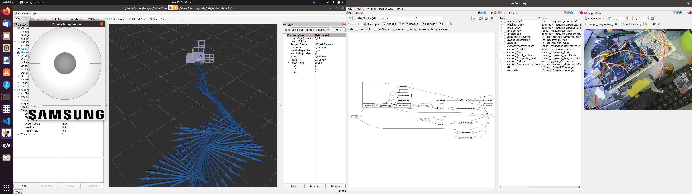

# Scooby package test to connect to STM

## Run

1. Setup environment variables:

        . ~/lma_ws/install/setup.bash

2. Launch the pure odometry simulation:

        ros2 launch motors_node test.launch.py use_rviz:=True use_teleop:=True


## Install

Assuming that the appropriate ROS2 version is already installed:

1. Install robot state publisher. 

        sudo apt install ros-foxy-robot-state-publisher

2. You require to have the package scooby_teleop and scooby_description

3. Go to your colcon workspace 
        cd ~lma_ws/src

4. Clone ros2-serial:
        git clone https://github.com/RoverRobotics-forks/serial-ros2 

5. Clone motor-node:

        git clone https://bitbucket.org/olmerg/motors_node.git

6. Build and install:

        cd ~/lma_ws
        colcon build

7. add serial conection to your user in linux (if it can not find serial port it will enter in simulation mode):
        dialout group to the user: sudo usermod -a -G dialout name_user


8. configure yaml with ports and baudrate optional (motors_node/param/scooby.yaml):
        serial:
                port1: "/dev/ttyACM0"
                port2: "/dev/ttyUSB0"
                baudrate: 115200

9. install 
	sudo apt-get install ros-foxy-joy ros-foxy-joy-linux ros-foxy-joy-teleop
10. add joystick to your user in linux
        sudo usermod -a -G input robot
11. connect the joystick an review the name of the devices with
	ls /dev/input
If the name should be *js0*, if it is different you should change in the *joy.launch.py* 

12. execute
	ros2 launch motors_node joy.launch.py use_rviz:=True
	
Instruction:

- hold button 4 and control with axis 0(v_x) and axis 1(w_z) the robot

- If you release the button before the axis the command to the robot will be hold.

- To stop the robot in any time press button 0 and 2


13. Configure or review number of button/axis (Optional)
	- view number of button in the next way, running $12$ in new console:
	
		ros2 topic echo /joy
	
	```
	  frame_id: joy
		axes:
		- -0.0
		- -0.0
		- 0.0
		- -0.0
		- 0.0
		- 0.0
		- 0.0
		- 0.0
		buttons:
		- 0
		- 0
		- 0
		- 0
		- 0
		- 0
		- 0
		- 0
		- 0
		- 0
		- 0
		---
	```
	
	- test each button or axes of the joystick and take notes of the number of the array which change
	- open param/joy_teleop.yaml and configure the axis and deadman_buttons which your preferences
	- save file and build again the package.
		
		 
## Motors simulation with Arduino Mega(COMING SOON)

Materials:

1. Arduino Mega 2560
3. motor driver TB6612FNG  (https://www.mactronica.com.co/driver-tb6612fng-control-motor-paso-a-paso)
4. small car 2wd (https://www.mactronica.com.co/carro-robotico-smart-car-v2)


Diagram 
Made in fritzing:


Assuming you have Arduino IDE installed already installed:

1. install library of th motor drivers from https://github.com/sparkfun/SparkFun_TB6612FNG_Arduino_Library

2. open motors_node/simuladorMotoresArduino/simuladorMotoresArduino.ino

3. review or modify the code

4. load the code to arduino


In my test I add a webcam to my computer, to view the car in the rqt, to make that I made:

1. install [ros2-v4l2](https://gitlab.com/boldhearts/ros2_v4l2_camera)
        sudo apt-get install ros-foxy-v4l2-camera
2. run the node (dev/video0 is the laptop webcam)
        ros2 run v4l2_camera v4l2_camera_node --ros-args -p video_device:="/dev/video2"
3. open rqt and add plugins->visualization->imagew view

4. add the topic */image_raw* to Image view plugin.


