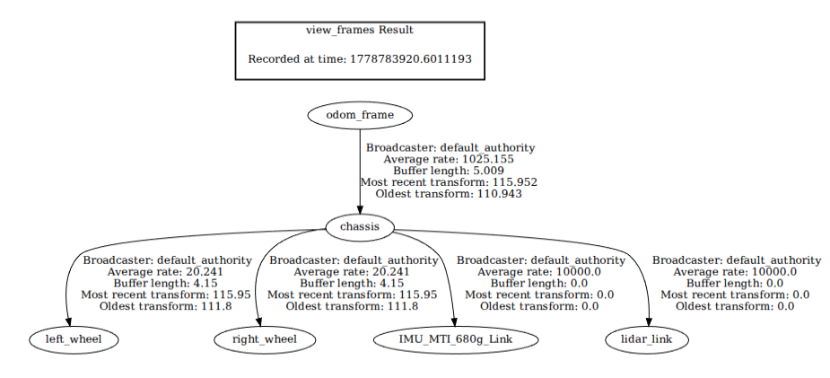

## Summary

This folder/package is responsible for executing the gazebo simulation.
The user can edit the file worlds/world.sdf.xacro to create his own world. 
> [!IMPORTANT]
> The robot models is not on this folder, it is on the package/folder amr_description.

Structure:
- launch: responsible for launching the gazebo simulation with the chosen world file.
- models: contains all the models used by the simulation. A model is usually a single item, such as a robot, a chair, a table, a wall, etc.
    - vehicle_blue: simplest model of a differential driven robot with 2 rear wheels and a caster wheel in the front.
    - wall: model for a wall.
    - x1: model of complex differential driven robot with 2 rear wheels and 2 front wheels.
- scenarios: contains all scenarios that can be inserted in a world. A scenario is usually a composite of items, which can be models, to create a scene. A scene could be a table with a floor, 2 tables and 10 chairs.
    - obstacle_scenario: a scene with multiple obstacles, such as walls and rectangle blocks.
- worlds: contains all the worlds created.
    - world.sdf.xacro: a sdf xacro file of a sdf world where scenarios and models can be put in to create a vast amount of different results. You could place the same scenario and models multiple times in different places to create a different scene altogether.
    - world.sdf: the result of converting world.sdf.xacro to sdf format.

> [!IMPORTANT]
> Be careful when inserting multiple models of robots. The topics could have the same names across multiple robots. For example: vehicle blue and x1 could have the same name for the imu topic and the topic that controls the robot (cmd_vel).


## Generate sdf from xacro

The conversion is done directly by the launch file, but the command used is:

```
ros2 run xacro xacro world2.sdf.xacro > temp.sdf
```

### Independent use
To use this package alone, follow the next instructions.
To use it with all the other packages, check the README.md of amr_launch.

1. Navigate to the root of your project
2. Build the project.

```
colcon build --packages-select amr_description
```

3. Source your project. 

```
. ./install/local_setup.bash
```

4. Run the launch file.

```
ros2 launch amr_simulation simulation_launch.py
```

5. A simulated world in gazebo should open.


## Troubleshooting


### RVIZ2 not showing the topic messages messages
An issue we had was the messages no being shown in rviz2. Even though the topic existed and was publishing messages, we would get the message: _Showing [0] points from [0] messages_. This error was caused by a failure in the tfs.

When our sensor does not define a frame using  ```<gz_frame_id>name of your frame</gz_frame_id>```, it was observed that gazebo uses a standard, ```model_name::link_name::type_of_sensor```. When we bridged the lidar, odometry, and imu topics to ros2, it could not find a transform between ```model_name::link_name::type_of_sensor``` and the ```base_link```.
Example: gazebo lidar frame id = my_vehicle::lidar_link::gpu_lidar, base_link = chassis.

As you can see in the image, there is no transform between these 2 frames.


Solution: insert inside of the ```<sensor></sensor>``` tags the tag ```<gz_frame_id>lidar_link</gz_frame_id>```. Now, the lidar topic will have the correct frame in its header.

> [!NOTE]
> You can overwrite a topic frame id in the launch file as well
> Example: 
```
  imu_ros2_gazebo_bridge_node = Node(
            package='ros_gz_bridge',
            executable='parameter_bridge',
            arguments=['/imu@sensor_msgs/msg/Imu[gz.msgs.IMU'],
            output='screen',
            parameters=[
                {'override_frame_id': 'IMU_MTI_680g_Link'}
            ],
    )
```


### [GUI] [Err] [VisualizeLidar.cc:285] The lidar entity with topic '['/scan'] could not be found. Error displaying lidar visual. 

According to https://www.reddit.com/r/ROS/comments/1r8tebh/jazzyharmonic_visualizelidar_error_topic_scan/ and
https://robotics.stackexchange.com/questions/118158/entity-spawning-issue-ros-gz-sim-solved-by-listing-link-potentially-bug, the sensor is not properly registred in the gazebo scene. A temporary fix is to query the robot model and the lidar link, which will register the sensor.

```gz model -m name_of_model -l name_of_lidar_link```

Example: ```gz model -m my_vehicle -l lidar_link```